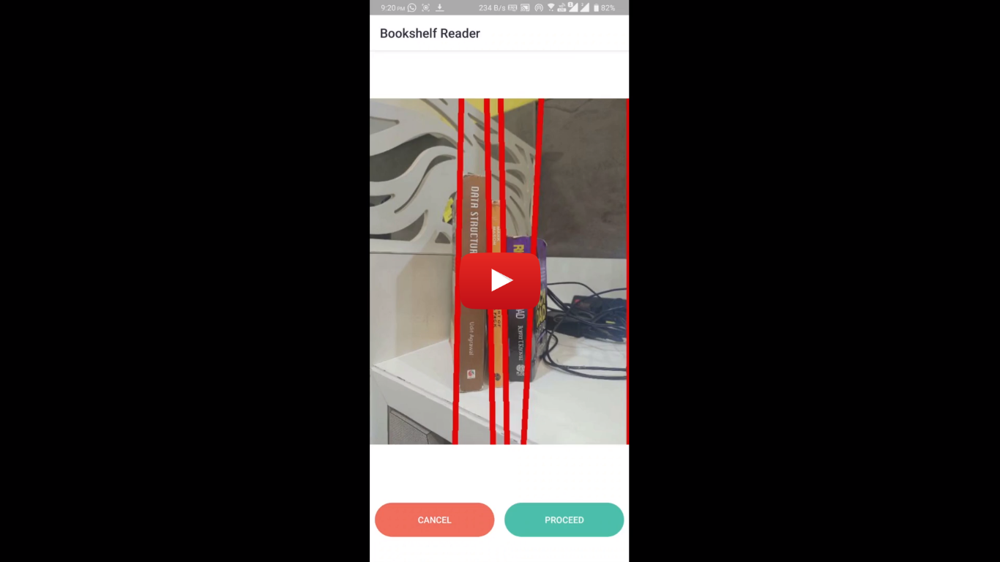
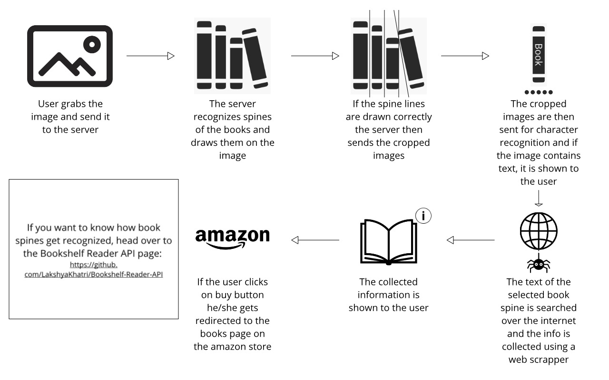

# Bookshelf-Reader
This application uses the [Bookshelf Reader REST API](https://github.com/LakshyaKhatri/Bookshelf-Reader-API) and provides book information from images of book spines. Just capture the image from your bookshelf and Bookshelf Reader will give you all the information on the available books in the image.

**NOTE: THIS PROJECT IS NO LONGER BEING MAINTAINED BY ME BECAUSE OF THE SERVER COSTS AND OTHER PROJECTS.**

# Demo

# Installation
Just download and install this [APK file](./app-debug.apk)

# Local Setup
 - Clone the repo.
 - Open it in Android Studio.
 - Setup Firebase requirements throught your account.

# Usage
* Capture image of a bookshelf from your camera or upload one from gallary (Make sure the spines are clearly visible).
* Bookshelf Reader will automatically detect separate the available books in the image from their spines. 
* Choose the book for which you want to get the information.
* To buy the book click on the GET ON AMAZON button.

# Here's How it Works

# Contributing
The whole framework was made for fun only. I used the general image processing techniques for making things work. I request everyone viewing this repository to kindly help me improve this project by implementing it using machine learning agorithms.

# License
MIT License

Copyright (c) 2020 Lakshya Khatri

Permission is hereby granted, free of charge, to any person obtaining a copy
of this software and associated documentation files (the "Software"), to deal
in the Software without restriction, including without limitation the rights
to use, copy, modify, merge, publish, distribute, sublicense, and/or sell
copies of the Software, and to permit persons to whom the Software is
furnished to do so, subject to the following conditions:

The above copyright notice and this permission notice shall be included in all
copies or substantial portions of the Software.

THE SOFTWARE IS PROVIDED "AS IS", WITHOUT WARRANTY OF ANY KIND, EXPRESS OR
IMPLIED, INCLUDING BUT NOT LIMITED TO THE WARRANTIES OF MERCHANTABILITY,
FITNESS FOR A PARTICULAR PURPOSE AND NONINFRINGEMENT. IN NO EVENT SHALL THE
AUTHORS OR COPYRIGHT HOLDERS BE LIABLE FOR ANY CLAIM, DAMAGES OR OTHER
LIABILITY, WHETHER IN AN ACTION OF CONTRACT, TORT OR OTHERWISE, ARISING FROM,
OUT OF OR IN CONNECTION WITH THE SOFTWARE OR THE USE OR OTHER DEALINGS IN THE
SOFTWARE.
